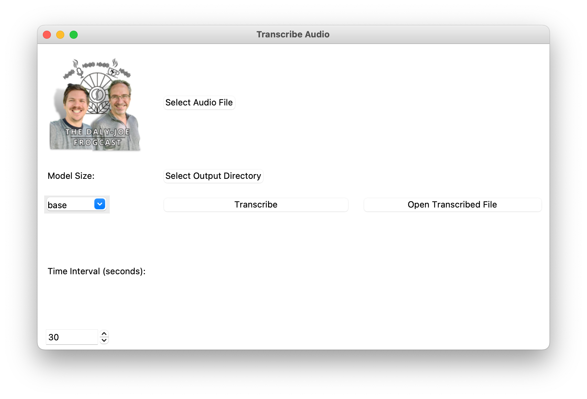
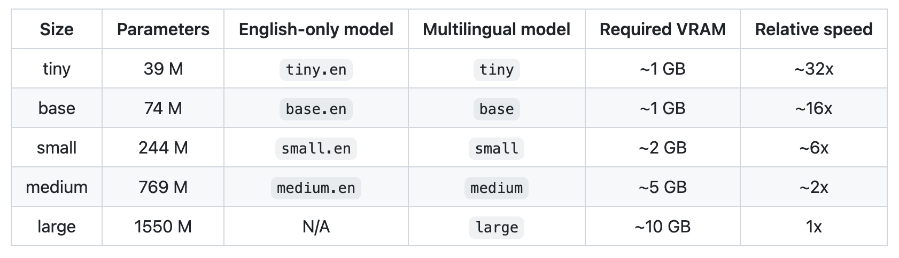
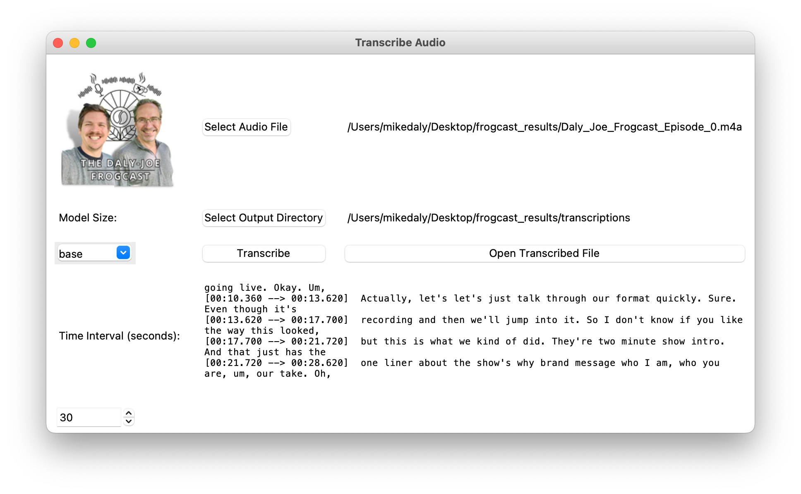

# Frogcast Transcription
Transcription service for the best frogcast in all of Willi!

## Transcribing Audio
1. Start up the GUI and you will see the image below (look at that beautiful mustache) 

2. Click the "Select Audio File" button to find your file to transcribe
   1. The Output Directory is automatically selected to be a "transcription" directory at the level of the Audio File
3. Optional Updates:
   1. Model Size:
      1. Select the transcription model. A larger model will run with more accuracy but will run slower
         1. 
   2. Time Interval:
      1. Increase/decrease the number of seconds to divide up the final results
4. Click Transcribe and the real time transcription will output to the GUI

5. The result will be shown in GUI or select the Open Transcribed File to open the output in your default text editor

# How to build the executable
1. Navigate to Your GUI Script: Open a terminal and navigate to the directory containing your GUI script (main.py).
2. Run PyInstaller with Poetry: Use the poetry run command to run PyInstaller with the Python interpreter managed by Poetry:
   1. `poetry run pyinstaller --onefile main.py`
   2. This will ensure that PyInstaller uses the correct environment and dependencies specified in your pyproject.toml file.
3. Locate the Executable in finder
   1. After PyInstaller finishes, you'll find a dist directory in your project folder. Inside this directory, there will be an executable file named main. You can double-click this executable to run your GUI.

poetry run pyinstaller --onefile --add-data "../images/daly_joe_frogcast_logo.png:images" main.py

